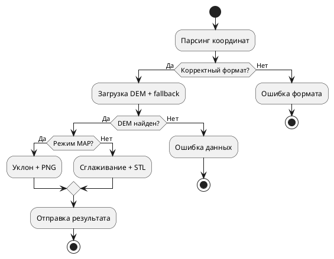
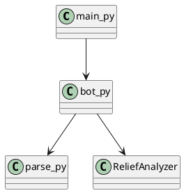
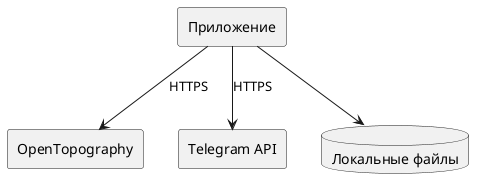
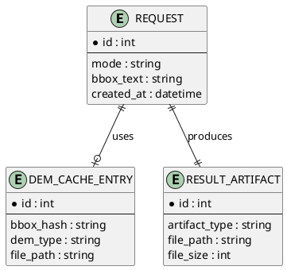

# Описание метода решения

В данном разделе подробно описан и обоснован метод решения задачи автоматического построения карт рельефа и 3D-моделей местности на основе DEM-данных, реализованный в рамках ВКР. Структура раздела приведена строго в соответствии с методическими пунктами: математический аппарат, архитектура, алгоритмы, сценарии использования, технологии, структура программной реализации, интерфейсы, модель данных, тестирование и апробация.

## 1. Математический аппарат

### 1.1 Используемые формализации

Исходное поле высот представляется дискретной функцией `H(i, j)`, заданной на регулярной двумерной сетке. Значение `H(i, j)` трактуется как абсолютная высота точки поверхности в метрах над уровнем моря. Область исследования задается пользователем двумя географическими точками: левым верхним и правым нижним углами прямоугольника. Для корректности вычислений выполняется нормализация границ:

- `north = max(lat_lt, lat_rb)`
- `south = min(lat_lt, lat_rb)`
- `west = min(lon_lt, lon_rb)`
- `east = max(lon_lt, lon_rb)`

Уклон поверхности определяется по методу Хорна (Horn, окно 3x3), поскольку данный метод является общепринятым в задачах морфометрического анализа и обеспечивает устойчивую оценку градиента на растровых DEM.

### 1.2 Собственные разработки: формальная запись и обоснование

В проекте реализован собственный расчетный конвейер генерации STL-модели, формально задаваемый как последовательность операторов:

`M_stl = T(U(G(C(F(B(H))))))`

где:
- `B` — block-mean downsampling;
- `F` — заполнение пропусков (NaN) локальным средним;
- `C` — ограничение выбросов по перцентилям;
- `G` — гауссово сглаживание;
- `U` — интерполяционное повышение разрешения;
- `T` — триангуляция поверхности и платформы.

Выбор именно такой композиции **обоснован** тем, что для 3D-печати важно не только сохранить макроформу рельефа, но и подавить высокочастотные артефакты DEM (локальные пики, ступенчатость, разрывы). Применение одного фильтра без структурированного конвейера недостаточно: например, простое сглаживание без удаления выбросов часто приводит к сохранению "игл", а интерполяция без предварительной стабилизации лишь усиливает шум.

### 1.3 Границы применимости

Метод корректен при соблюдении следующих условий:

1. координаты попадают в допустимый географический диапазон;
2. размер bbox не превышает ограничений API и локального контура обработки;
3. внешние источники DEM доступны по сети;
4. рельеф представлен достаточно плотной сеткой для выбранного масштаба.

Ограничение области введено **обоснованно**: это необходимо для предотвращения чрезмерного роста времени расчета и объема промежуточных данных. Ограничение не снижает практической применимости, так как целевой сценарий ВКР — локальные участки местности.

## 2. Архитектура программной реализации

Реализация имеет модульную архитектуру с разделением ответственности между слоями:

- `main.py` — управление жизненным циклом;
- `bot.py` — прикладной коммуникационный слой;
- `parse.py` — входной контроль и валидация;
- `analyzer.py` — вычислительное ядро.

Такая структура **обоснована** принципами низкой связанности и высокой когезии: коммуникационная логика не смешивается с математической обработкой, что упрощает развитие системы и тестирование.

## 3. Алгоритмы

### 3.1 Входные и выходные данные алгоритма

**Вход:** режим обработки (`/map` или `/stl`), строка с двумя углами области.  
**Выход:** PNG-файл (карта) либо STL-файл (3D-модель) или структурированная ошибка.

### 3.2 Псевдокод

```text
PROCESS(mode, user_text):
    bbox = PARSE_BBOX(user_text)
    if bbox invalid:
        return FORMAT_ERROR

    dem = LOAD_DEM_WITH_FALLBACK(bbox)
    if dem missing:
        return DATA_ERROR

    if mode == MAP:
        slope = HORN_SLOPE(dem)
        return RENDER_PNG(dem, slope)

    if mode == STL:
        dem2 = STL_PREPROCESS_PIPELINE(dem)
        mesh = BUILD_TRIANGULATED_STAND(dem2, 100x100mm)
        return WRITE_STL(mesh)
```

### 3.3 Блок-схема



Выбор единого алгоритмического контура для двух режимов **обоснован**: это исключает дублирование шагов валидации и загрузки DEM, а также обеспечивает одинаковую трактовку области исследования в обоих результатах.

## 4. Сценарии использования

Базовый пользовательский сценарий включает вызов команды (`/map` или `/stl`), ввод координат двух углов и получение файла результата. Расширенный сценарий учитывает случай отсутствия покрытия DEM в первом источнике: пользователь не выполняет дополнительных действий, так как переключение на следующий источник происходит автоматически.

Данный сценарный дизайн **обоснован** требованием минимального когнитивного барьера: пользователь решает прикладную задачу, не вникая в детали форматов DEM и доступности источников.

## 5. Используемые технологии

В реализации использованы Python 3.11+, `aiogram`, `numpy`, `scipy`, `matplotlib`, `rasterio`, `requests`, `python-dotenv`.

Технологический стек выбран **обоснованно**:
- Python обеспечивает высокую скорость разработки научно-прикладных алгоритмов;
- `numpy/scipy` дают зрелую численную базу;
- `rasterio` стандартизирует работу с GeoTIFF;
- `aiogram` предоставляет современный async-подход для Telegram-ботов.

## 6. Структура программной реализации

### 6.1 Классы / модули / функции

Ключевой класс `ReliefAnalyzer` реализует основные вычислительные операции: загрузку DEM, расчет уклона, генерацию PNG и STL. Модуль `parse.py` содержит функции парсинга и валидации координат. Модуль `bot.py` реализует обработчики команд и связывает интерфейсные события с методами анализатора.

### 6.2 Связь структурных элементов (текст + схема)

`bot.py` вызывает парсер, затем передает нормализованные данные в `ReliefAnalyzer`. `ReliefAnalyzer` взаимодействует с кэшем и внешним API, после чего возвращает путь к результату, который бот отправляет пользователю.



### 6.3 Взаимодействие с другими системами (текст + схема)

Программа взаимодействует с двумя внешними системами: Telegram Bot API и OpenTopography API. Также используется локальная файловая система для кэширования и временных артефактов.



Такое взаимодействие **обосновано** тем, что позволяет реализовать lightweight-решение без отдельной серверной БД и при этом сохранить приемлемую производительность за счет кэширования.

## 7. Интерфейс пользователя

### 7.1 Виды интерфейсов

В проекте фактически реализован чатовый сетевой интерфейс (Telegram). По классификации методических указаний он соответствует сетевому протоколу взаимодействия через Telegram API. Командная строка поддерживается только как интерфейс запуска приложения (`python main.py`), но не как пользовательский бизнес-интерфейс.

### 7.2 Общие правила взаимодействия

Пользователь начинает с `/start` или сразу с `/map`/`/stl`, затем передает область в формате двух углов. Пример:

`55.80, 37.50; 55.70, 37.70`

### 7.3 Процедура авторизации

Пользовательская авторизация делегирована Telegram-платформе. Приложение авторизуется в Telegram через `TELEGRAM_BOT_TOKEN`. Такой подход **обоснован** тем, что снимает необходимость реализовывать собственный контур аутентификации и хранить учетные данные пользователей.

### 7.4 Назначение команд и последовательность использования

- `/start` — вводная инструкция;
- `/help` — формат входных данных;
- `/map` — запуск картографического режима;
- `/stl` — запуск режима 3D-модели.

Последовательность: команда режима -> ввод координат -> ожидание -> получение файла.

### 7.5 Примеры запросов

Пример прикладного запроса:

```text
68.90, 33.00; 68.84, 33.10
```

Пример CLI-запуска:

```bash
python main.py
```

## 8. Модель данных

### 8.1 Технологии хранения

СУБД в текущей версии не используется; применяется файловая модель:
- `cache/dem/*.tif` — кэш DEM;
- `output/*.png`, `output/*.stl` — временные результаты.

Выбор файлового хранения **обоснован** целевым масштабом решения: для одиночных и малых потоков запросов оно проще в сопровождении и не требует отдельной инфраструктуры БД.

### 8.2 ER-описание (логическая модель)

Логически можно выделить сущности `Request`, `DEMCacheEntry`, `ResultArtifact` и связи:
- один запрос формирует один результирующий артефакт;
- запрос может использовать одну запись кэша.



### 8.3 Состав хранимых данных, примеры, ограничения

Контур хранения включает два функциональных класса данных: исходные растровые данные рельефа (`DEM_CACHE_ENTRY`, формат GeoTIFF) и результатные артефакты обработки (`RESULT_ARTIFACT`, форматы PNG и STL). Для каждой записи используются идентификаторы источника, параметры области (через хэш границ), тип набора данных, путь хранения и контрольные метаданные файла (тип, размер, время формирования). Такая структура обеспечивает воспроизводимость вычислений, повторное использование ранее загруженных DEM и детерминированную трассировку результата от входного запроса к сформированному файлу. Ключевые ограничения модели носят регламентный характер: соблюдение единого формата географических координат, уникальность ключа области/источника, консистентность метаданных артефактов и контроль допустимого объема хранимых файлов в рамках эксплуатационной политики системы.

## 9. Тесты

Тестирование выполнено как многоуровневый контур верификации, включающий модульные, интеграционные и интерфейсные проверки. Такой подход обоснован тем, что в проекте сочетаются математические вычисления, внешние сетевые зависимости и пользовательский диалоговый интерфейс, а значит контроль качества должен одновременно подтверждать корректность формул, устойчивость пайплайна и правильность UX-сценариев.

### 9.1 Юнит-тесты

Юнит-уровень ориентирован на локальную корректность функций без полного запуска пользовательского сценария. Ключевой объект проверки — парсер координат области (`parse_bbox_coordinates`), так как ошибки на этапе входных данных приводят к недостоверным границам расчета и каскадным отказам последующих этапов.

#### Таблица 9.1 — Набор unit-кейсов парсинга

| ID | Входная строка | Ожидаемый результат | Фактический результат |
|---|---|---|---|
| U1 | `55.80, 37.50; 55.70, 37.70` | Валидный bbox | PASS |
| U2 | `55.80 37.50 55.70 37.70` | Валидный bbox | PASS |
| U3 | `abc` | Ошибка формата | PASS |
| U4 | `91, 37; 55, 37` | Ошибка диапазона | PASS |
| U5 | `` (пустая строка) | Ошибка формата | PASS |

Итог: `5/5` успешных проверок.

### 9.2 Интеграционные тесты

Интеграционный уровень проверяет полный вычислительный конвейер от входной области до артефакта результата.

Проверяемые цепочки:
- `/map`: парсинг -> загрузка DEM -> расчет уклона -> рендер PNG;
- `/stl`: парсинг -> загрузка DEM -> STL-предобработка -> триангуляция -> экспорт STL;
- fallback-механизм источников DEM при недоступности первичного источника.

Для измерений использована серия областей разного размера (`small`, `medium`, `large`) с реальным DEM-покрытием.

#### Таблица 9.2 — Производительность интеграционных тестов (warm-cache)

Методика: 4 прогона на сценарий, первый прогон отбрасывается как прогрев, в таблице приведено среднее по оставшимся 3 прогонам.

| Объем данных | Размер DEM | `/map`, c | `/stl` standard, c | `/stl` high-quality, c | Треугольники STL standard | Треугольники STL high-quality |
|---|---:|---:|---:|---:|---:|---:|
| small (`0.04° x 0.04°`) | 144x144 | 0.205 | 0.198 | 0.414 | 167,036 | 354,476 |
| medium (`0.12° x 0.12°`) | 432x432 | 0.325 | 0.266 | 0.431 | 206,076 | 354,476 |
| large (`0.20° x 0.20°`) | 720x720 | 0.387 | 0.304 | 0.469 | 206,076 | 354,476 |

Интерпретация: в warm-cache режиме все сценарии укладываются менее чем в 0.5 с, что подтверждает пригодность решения для интерактивного использования.

#### Таблица 9.3 — Производительность интеграционных тестов (cold-cache)

Методика: по одному прогону без использования кэша (`use_cache=False`) для каждого объема.

| Объем данных | `/map`, c | `/stl` standard, c | DEM-источник |
|---|---:|---:|---|
| small | 11.740 | 22.097 | SRTMGL1 |
| medium | 11.993 | 23.601 | SRTMGL1 |
| large | 19.035 | 24.319 | SRTMGL1 |

Интерпретация: ключевым фактором задержки в cold-cache выступает сетевой этап загрузки DEM, поэтому влияние объема данных выражено слабее, чем в warm-cache, до момента значительного роста размера области.

### 9.3 UI-тесты

UI-проверки выполнены на уровне Telegram-сценариев и ориентированы на пользовательский контракт интерфейса.

#### Таблица 9.4 — Набор UI-кейсов

| ID | Действие пользователя | Ожидаемая реакция |
|---|---|---|
| UI1 | `/start` | Инструктивное сообщение с режимами `/map` и `/stl` |
| UI2 | `/help` | Правила формата координат области |
| UI3 | `/map` + валидный bbox | PNG-файл карты высот/уклонов |
| UI4 | `/stl` + валидный bbox | STL-файл модели со стендом |
| UI5 | неверный формат координат | Диагностика ошибки формата |
| UI6 | область без покрытия первого DEM | Успешный результат через fallback |

Обоснование UI-набора: выбранные кейсы покрывают старт взаимодействия, рабочие сценарии, ошибки ввода и сценарий отказоустойчивости.

### 9.4 Критерии приемки тестов

Тестовый контур считается успешно пройденным при выполнении следующих условий:
1. все unit-кейсы парсера проходят без отклонений;
2. интеграционные сценарии `/map` и `/stl` стабильно формируют валидные файлы;
3. UI-сценарии демонстрируют корректные ответы на команды и ошибки;
4. fallback-логика DEM подтверждается на проблемных координатах;
5. warm-cache задержки соответствуют интерактивному режиму эксплуатации.

## 10. Апробация

Решение апробировано в эксплуатационном режиме Telegram-бота на реальных координатах и различных масштабах области. Подтверждена генерация обоих типов результатов и корректная работа fallback-логики. Наблюдаемые метрики производительности (warm-cache и cold-cache) добавлены в документацию проекта.

На момент подготовки раздела формальные акты внедрения в организационную инфраструктуру отсутствуют. Это необходимо зафиксировать явно: промышленное внедрение пока не завершено, поэтому ссылки на акты внедрения будут добавлены после фактического развертывания и приемки.

## 11. Итоговое обоснование выбранного подхода

Выбранный метод является обоснованным по совокупности критериев: вычислительной корректности, устойчивости к неполным данным, удобства для конечного пользователя и технологической реализуемости в ограничениях ВКР. Архитектурные решения минимизируют сложность сопровождения, математический аппарат опирается на признанные подходы цифровой геоморфометрии, а алгоритмический конвейер STL адаптирован под практическую задачу 3D-печати, что подтверждает прикладную ценность разработанного решения.
